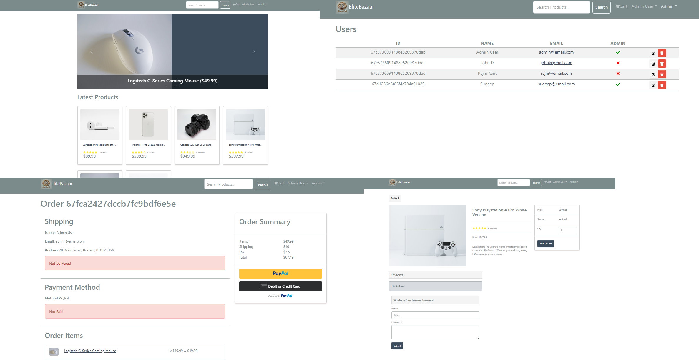

# 🛍️ EliteBazaar

**EliteBazaar** is a full-featured eCommerce application built with the MERN stack (MongoDB, Express, React, Node.js). It includes a shopping cart, user authentication, product management, and secure payments via PayPal.

---

## 🚀 Features

- User authentication & authorization (JWT)
- Product management (CRUD)
- Cart functionality
- PayPal integration
- Admin dashboard
- File upload with Multer
- Toast notifications
- Fully responsive UI (React Bootstrap)
- MongoDB Atlas integration

---

## 🧰 Tech Stack

**Frontend:**
- React
- Redux Toolkit
- React Router DOM
- Bootstrap & React-Bootstrap
- Axios
- PayPal SDK

**Backend:**
- Node.js
- Express.js
- MongoDB + Mongoose
- JSON Web Token (JWT)
- Multer (for image upload)
- dotenv

**Dev Tools:**
- Nodemon
- Concurrently
- ESLint
- React Scripts

---

## 📦 Installation

Clone the repository:

```bash
git clone https://github.com/your-username/elitebazaar.git
cd elitebazaar
